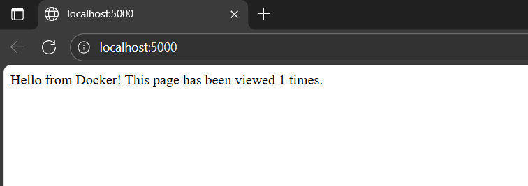
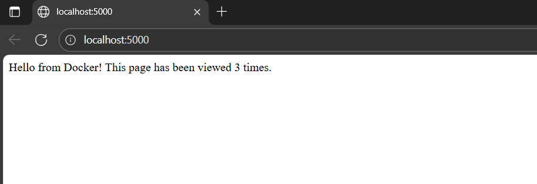
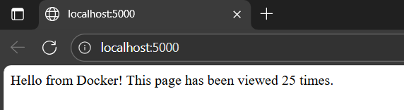

# Практичне заняття «Робота з Dockerfile та Docker Compose»

## Тема

Робота з директивами Dockerfile та запуск багатосервісного застосунку (Flask + Redis) за допомогою Docker Compose.

## Мета роботи

Навчитися працювати з директивами Dockerfile і запускати багатосервісний застосунок (Flask + Redis) за допомогою Docker Compose. 

## Архітектура застосунку

Застосунок побудований на базі мікросервісної архітектури, що оркеструється за допомогою Docker Compose. Він включає два основних сервіси:

- **web (Flask-додаток)** —  Python-сервер, що написаний на Flask, який слухає порт 5000 . Він підключається до сервісу redis для підрахунку кількості відвідувань сторінки. Його образ збирається локально за допомогою Dockerfile.

- **redis (База даних)** — Сервіс Redis (використовується готовий образ redis:7), який виступає як база даних In-memory для зберігання лічильника (hits).

Конфігурація інфраструктури описана у наступних файлах:

- **Dockerfile** — Описує кроки для збірки образу web: встановлення python:3.9, копіювання файлів, встановлення залежностей через pip та запуск app.py.

- **docker-compose.yml** — Визначає обидва сервіси (web та redis), зв'язує їх (depends_on: - redis ), та прокидає порт 5000:5000 з контейнера web на хост-машину.

## Файл застосунку (app.py)

```py 
from flask import Flask
import redis, os
app = Flask(__name__)
redis_client = redis.StrictRedis(host='redis', port=6379, decode_responses=True)
@app.route('/')
def hello():
    count = redis_client.incr('hits')
    return f"Hello from Docker! This page has been viewed {count} times."
if __name__ == '__main__':
    port = int(os.environ.get('APP_PORT', 5000))
    app.run(host='0.0.0.0', port=port)
```

## Файл залежностей (requirements.txt)

```
flask==3.1.0
redis==7.0.1
```

## Файл Dockerfile

```dockerfile
FROM python:3.9
ENV PYTHONUNBUFFERED=1
WORKDIR /app
COPY requirements.txt .
COPY app.py .
RUN pip install -r requirements.txt
EXPOSE 5000
CMD ["python", "app.py"]
```

## Файл Docker Compose (docker-compose.yml)

```yaml
version: "3.8"
services:
  web:
    build: .
    ports:
      - "5000:5000"
    environment:
      - APP_PORT=5000
    depends_on:
      - redis
  redis:
    image: redis:7
```

## Перевірка роботи

Запуск сервісів виконується командою: 

```
docker compose up --build
```

Після успішного запуску, додаток доступний у браузері за адресою http://localhost:5000. 

## Очікуваний результат (Скріншот лічильника) 

Після відкриття http://localhost:5000 та кількох оновлень сторінки, лічильник збільшується, що підтверджує успішне підключення до redis.

**Перший запуск ( лічильний = 1)**
<p align="center"> 
   
</p>

**Оновлення сторінки лічильник збільшується**
<p align="center"> 
   
</p>

<p align="center"> 
   
</p>

## Висновок

Під час виконання цього практичного заняття були досягнуті наступні цілі:

- **Вивчено директиви Dockerfile:** FROM, ENV, WORKDIR, COPY, RUN, EXPOSE, CMD.

- **Опановано Docker Compose:** Успішно запущено два взаємопов'язані сервіси (web та redis).

Перевірено роботу програми: Працюючий Flask-додаток з лічильником на Redis був успішно піднятий і перевірений у браузері, що відповідає очікуваним результатам практичної роботи.
